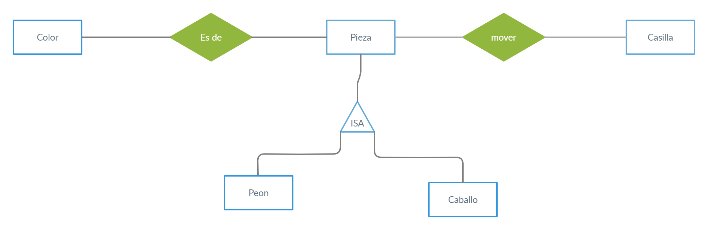

# Ajedrez

El programa ajedrez.pl comprobará los movimientos válidos y te dirá todos los movimientos posibles dado un estado del tablero.

Para hacer más simple este ejemplo se usará un tablero de 5x5 representado con coordenadas (X,Y).

Se implementarán solo los caballos y los peones.

## Diagrama del tablero

y\x  | 1  |  2  |  3  |  4  |  5  
:--|:---:|:---:|:---:|:---:|:---:
**5**  | v | v | v | v | v 
**4**  | v | pn1 | v | v | v 
**3**  | v | v | pn2 | kn | v 
**2**  | pb1 | pb2 | v | v | v 
**1**  | v | v | v | kb | v |

> pn1, pn2 son peones blancos.

> pn2, pn3 son peones negros.

> kn es un caballo blanco.

> kb es un caballo negro.

> v la casilla está vacía.

## Reglas de juego en lenguaje natural.

1. Un peón puede moverse hacia adelante un espacio si este no está ocupado.

2. Un peón puede moverse 2 espacios hacia adelante si es su primer movimiento, no puede atravesar otras piezas
en su camino.

3. Un peón puede moverse un espacio diagonal (un espacio hacia adelante y uno horizontal) si la casilla la ocupa una pieza enemiga.

4. Un caballo puede moverse dos espacios en vertical y uno horizontal o 2 espacios en horizontal y uno en vertical.

5. Un caballo puede atravesar piezas en su camino.

6. Un caballo no puede terminar su movimiento en una casilla con piezas aliadas, si lo puede hacer si la pieza es enemiga.

## Modelo Conceptual de entidades

